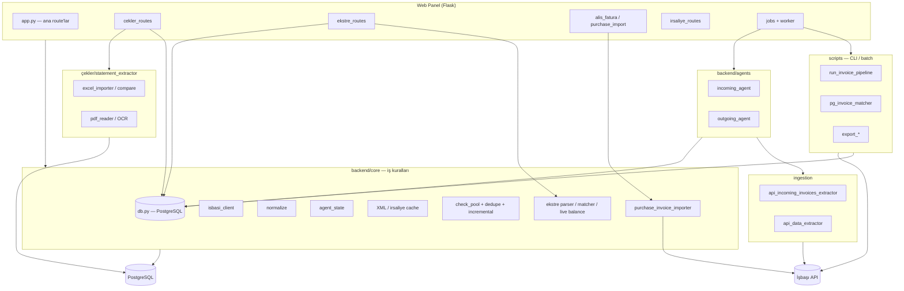
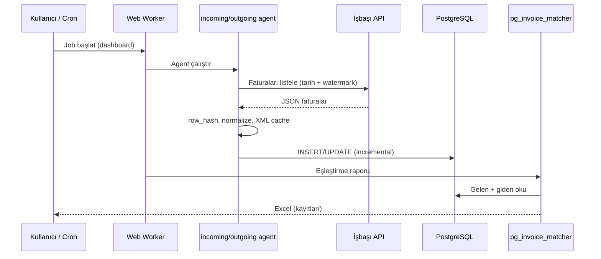
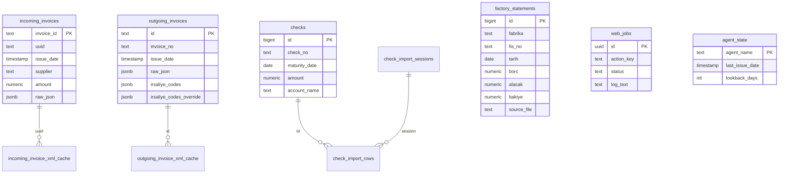
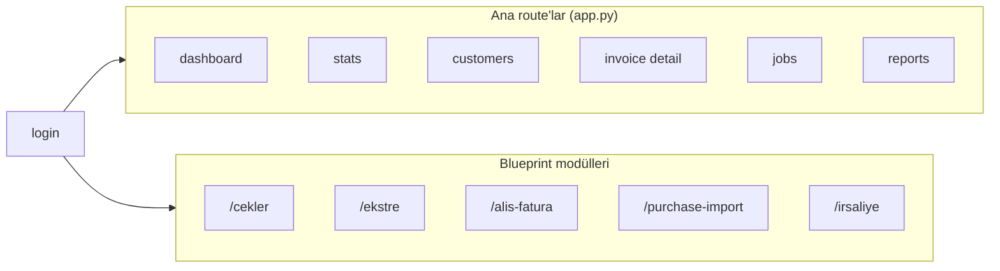
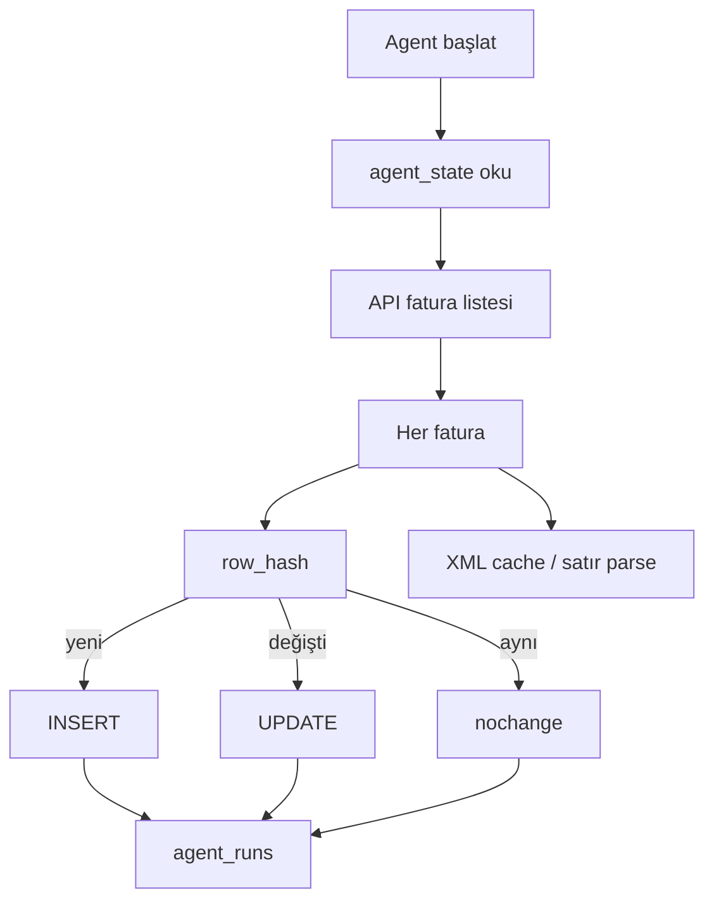
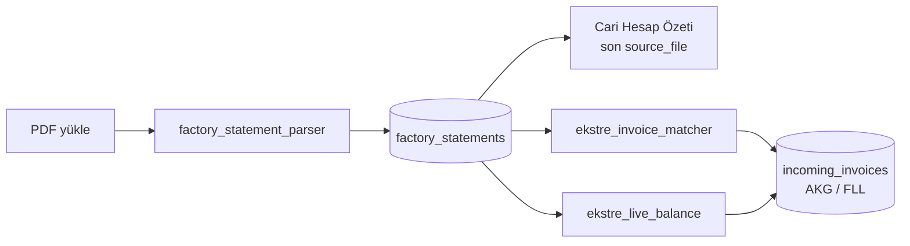

# E-Fatura Yönetim Sistemi — Kod Mimarisi ve Fonksiyon Şeması

Bu doküman projenin kod mimarisini, modül ilişkilerini ve ana fonksiyon akışlarını özetler.

**Depo:** https://github.com/Sarp123kaya/efatura-yonetim-sistemi  
**Güncel geliştirme dalı:** `VPS`

---

## 1. Üst seviye mimari



### Katman özeti

| Katman | Rol |
|--------|-----|
| `ingestion/` | Ham API çağrıları, sayfalama, JSON |
| `backend/agents/` | Artımlı çekme, hash, DB upsert |
| `backend/core/` | Ortak DB, normalize, İşbaşı client, domain modülleri |
| `backend/web/` | Kullanıcı arayüzü, iş kuyruğu, blueprint'ler |
| `scripts/` | Tek komutla pipeline, eşleştirme, export |
| `çekler/` | Excel/PDF/OCR ile çek parse (web `/cekler` bunu kullanır) |
| `sql/` | Şema ve migration dosyaları |

### Klasör yapısı (özet)

```text
.
├── backend/
│   ├── agents/          # incoming_agent, outgoing_agent
│   ├── core/            # db, config, domain modülleri
│   └── web/             # Flask app, templates, worker
├── ingestion/           # İşbaşı API extractor'ları
├── scripts/             # CLI pipeline ve raporlar
├── sql/                 # PostgreSQL şema + migration
├── çekler/              # statement_extractor (Excel/OCR)
├── docs/                # Rehberler (bu dosya dahil)
├── deploy/                # nginx, systemd
├── data/                # Yerel cache, log (Git dışı)
└── kayıtlar/            # Üretilen Excel raporları
```

---

## 2. Veri akışı (ana iş hattı)



**Stateful ingestion:** `agent_state` tablosunda son işlenen tarih tutulur. Her çalıştırmada yalnızca yeni veya değişen kayıtlar işlenir (`change_type`: `insert` / `update` / `nochange`).

**Ana pipeline:** `scripts/run_invoice_pipeline.py`

1. Gelen faturaları API'den çek → PostgreSQL  
2. Giden faturaları API'den çek → PostgreSQL  
3. Eşleştirme Excel'i (`pg_invoice_matcher`)  
4. Opsiyonel ters eşleştirme, irsaliye raporu, fabrika/müşteri export'ları  

---

## 3. PostgreSQL — ana tablolar



### Migration dosyaları (kurulum sırası özeti)

| Dosya | İçerik |
|-------|--------|
| `sql/stateful_ingestion_schema_v2.sql` | Gelen/giden fatura, agent_state, agent_runs |
| `sql/migration_v2.2_despatch_improvements.sql` | İrsaliye iyileştirmeleri |
| `sql/migration_incoming_xml_cache.sql` | Gelen XML önbellek |
| `sql/migration_outgoing_xml_cache.sql` | Giden XML önbellek |
| `sql/migration_irsaliye_override.sql` | Manuel irsaliye override |
| `sql/migration_check_pool.sql` | Çek havuzu |
| `sql/migration_factory_statements.sql` | Fabrika ekstre |
| `sql/migration_web_jobs.sql` | Panel arka plan işleri |
| `sql/migration_factory_kar.sql` | Fabrika kâr tabloları (opsiyonel) |

---

## 4. Web panel — sayfalar ve modüller

`backend/web/app.py` çekirdek uygulamadır. Ek özellikler **Blueprint** ile eklenir.



| Modül | Dosya | Fonksiyon |
|-------|--------|-----------|
| **Dashboard** | `app.py`, `actions.py` | Eşleştirme özeti, job tetikleme |
| **İşler** | `jobs.py`, `worker.py` | Uzun script/agent arka planda |
| **Müşteriler** | `app.py`, `check_customer_views.py` | Ciro, bakiye; çek özeti (gelecek / ödenen) |
| **Çekler** | `cekler_routes.py` | Excel/OCR import, diff, mükerrer birleştirme |
| **Ekstre** | `ekstre_routes.py` | PDF parse, özet, fatura karşılaştırma, canlı bakiye |
| **Alış faturası** | `purchase_import_routes.py`, `alis_fatura_routes.py` | AKG/FLL → İşbaşı alış faturası |
| **İrsaliye düzelt** | `irsaliye_routes.py`, `irsaliye_override.py` | Giden fatura irsaliye override |
| **İstatistik / Rapor** | `stats`, `reports` | Aggregasyon, Excel indirme |

### Kimlik doğrulama

| Kullanıcı | Varsayılan (yerel) | Ortam değişkenleri |
|-----------|-------------------|---------------------|
| Admin | `admin` / `admin` | `WEB_ADMIN_USER`, `WEB_ADMIN_PASSWORD` |
| Kişisel | `c` / `c` | `WEB_PERSONAL_USER`, `WEB_PERSONAL_PASSWORD` |

Dış ağdan giriş için ilgili parola `.env` içinde tanımlı olmalıdır.

---

## 5. `backend/core` — domain modülleri

| Modül | Görev |
|-------|--------|
| `db.py` | PostgreSQL bağlantı, sorgu, batch |
| `config.py` | `.env` yapılandırması |
| `isbasi_client.py` | İşbaşı API oturum ve çağrılar |
| `isbasi_endpoints.py` | Endpoint sabitleri / dokümantasyon |
| `normalize.py` | İrsaliye kodu normalize (A-/F- önek) |
| `agent_state.py` | Agent watermark yönetimi |
| `agent_run_logger.py` | Agent çalışma logları |
| `incoming_xml_cache.py` | Gelen fatura XML önbelleği |
| `outgoing_xml_cache.py` | Giden fatura XML önbelleği |
| `incoming_despatch_cache.py` | Gelen irsaliye açıklama cache |
| `ubl_line_parser.py` | UBL satır kalemleri |
| `purchase_invoice_importer.py` | AKG/FLL alış faturası aktarımı |
| `factory_statement_parser.py` | Fabrika PDF ekstre parse |
| `ekstre_invoice_matcher.py` | Ekstre ↔ gelen fatura eşleştirme |
| `ekstre_live_balance.py` | Son ekstre bakiyesi − yeni faturalar |
| `ekstre_fatura_compare.py` | Fabrika VKN yardımcıları |
| `check_pool.py` | Çek modeli ve import altyapısı |
| `check_excel_incremental.py` | Excel sürüm diff |
| `check_dedupe.py` | Çek no mükerrer birleştirme |
| `check_customer_views.py` | Müşteri sayfası çek özetleri |
| `irsaliye_override.py` | İrsaliye override kalıcılığı |
| `payment_import.py` | Ödeme/çek import (script entegrasyonu) |

---

## 6. Agent'lar



| Agent | Dosya | Kaynak | Hedef tablo |
|-------|--------|--------|-------------|
| Gelen | `incoming_agent.py` | `myInvoicesList` | `incoming_invoices` |
| Giden | `outgoing_agent.py` | giden fatura API | `outgoing_invoices` |

---

## 7. Scripts — operasyon komutları

| Script | Rol |
|--------|-----|
| `run_invoice_pipeline.py` | Uçtan uca ana akış |
| `pg_invoice_matcher.py` | Giden ↔ gelen eşleştirme |
| `pg_reverse_matcher.py` | Gelen → giden ters kontrol |
| `match_incoming_despatches_to_outgoing.py` | E-irsaliye eşleştirme |
| `export_supplier_invoice_details.py` | AK GİPS / FULLBOARD ürün Excel |
| `export_customer_product_prices.py` | Müşteri fiyat analizi |
| `export_to_excel.py` | Genel Excel export |
| `import_factory_purchase_invoices.py` | CLI alış faturası |
| `import_customer_checks.py` | Müşteri çek import |
| `sync_factory_kar.py` | Fabrika kâr senkronu |
| `start_web_panel.py` | Web panel başlat |
| `run_web_worker.py` | Job worker başlat |
| `setup_postgres.sh` | DB kurulum |
| `verify_installation.py` | Kurulum doğrulama |
| `probe_*.py` | API keşif / debug (üretim akışı değil) |

Web panel **İşler** sayfası `backend/web/actions.py` içindeki `ActionDefinition` kayıtlarıyla bu script'leri parametreli çalıştırır.

---

## 8. Çekler alt sistemi

```text
çekler/statement_extractor/
├── src/
│   ├── excel_importer.py      # Excel → StoredCheckRecord
│   ├── excel_compare.py       # İki Excel diff (check_no kimliği)
│   ├── snapshot_manager.py    # Snapshot (web: data/check_excel_snapshots/)
│   ├── zirve_muavin_excel.py  # Zirve muavin formatı
│   ├── image_ocr_reader.py    # Çek görüntü OCR
│   └── validators.py        # duplicate_key, validasyon
└── tests/
```

**Web entegrasyonu:** `backend/web/cekler_routes.py` → tablolar `checks`, `check_import_sessions`, `check_import_rows`.

**İş kuralları (özet):**

- Yeni Excel önceki snapshot ile karşılaştırılır; yalnızca eklenen/değişen satırlar işlenir.  
- Aynı **çek numarası** tek kayıt sayılır (mükerrer birleştirme).  
- Liste varsayılan: vadesi gelecek; vadesi geçmiş ayrı butonla.  
- Müşteri sayfasında: vadesi gelecek listelenir; vadesi geçmiş = ödenmiş kabul (tutar özeti).

---

## 9. Fabrika ekstre modülü



| Bileşen | Açıklama |
|---------|----------|
| Parser | AK GİPS ve FULLBOARD PDF formatları |
| Özet | Her fabrika/cari hesap için en son yüklenen dosya |
| Karşılaştırma | Ekstre fatura satırları ↔ gelen e-fatura |
| Canlı bakiye | Son ekstre kapanış bakiyesi − sonraki gelen faturalar |

---

## 10. Eşleştirme mantığı (irsaliye)

1. Giden faturada `irsaliye_codes` (API/XML'den).  
2. Gelen faturada / irsaliyede kodlar `normalize.py` ile `A-xxxxx` / `F-xxxxx` formatına çekilir.  
3. `pg_invoice_matcher` PostgreSQL üzerinden eşleştirir.  
4. Manuel düzeltme: `irsaliye_codes_override` (`irsaliye_override.py`).

---

## 11. Dağıtım ve çalıştırma

| Bileşen | Konum |
|---------|--------|
| Docker | `Dockerfile`, `docker-compose.yml` |
| Systemd | `deploy/systemd/efatura-web.service`, `efatura-worker.service` |
| Nginx | `deploy/nginx/efatura-panel.conf` |
| Bağımlılıklar | `requirements.txt` |

**Tipik yerel başlatma:**

```bash
# PostgreSQL + .env hazır olduktan sonra
python scripts/start_web_panel.py
python scripts/run_web_worker.py
```

**İlgili dokümanlar:**

- `docs/WEB_PANEL.md` — panel yapılandırması  
- `docs/KOMUTLAR.md` — komut referansı  
- `docs/PROJECT_STRUCTURE.md` — klasör yapısı  
- `docs/YENI_BILGISAYAR_KURULUM_REHBERI.md` — kurulum  

---

## 12. Özet

| Soru | Cevap |
|------|--------|
| Veri nerede? | PostgreSQL (`backend/core/db.py`) |
| API kim? | İşbaşı (`isbasi_client.py`) |
| Otomatik çekme? | `incoming_agent` / `outgoing_agent` |
| UI? | Flask `backend/web/` + blueprint'ler |
| Uzun işler? | `web_jobs` + `worker.py` |
| Raporlar? | `scripts/` → `kayıtlar/*.xlsx` |
| Çekler? | `çekler/` + `cekler_routes` |
| Fabrika ekstre? | `ekstre_routes` + `factory_statement_parser` |

---

*Son güncelleme: VPS dalı özellikleri (ekstre karşılaştırma, canlı bakiye, çek incremental import, çift giriş, irsaliye düzeltme) dahil edilmiştir.*
